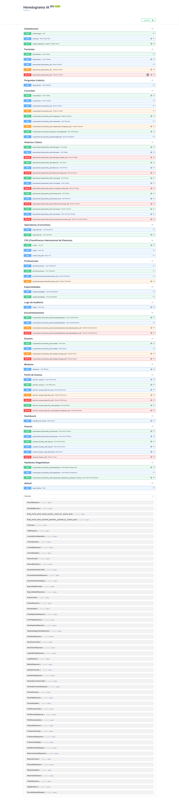

# clinical-genetics-emr

Electronic medical record for genetic counseling, with AI-assisted pedigree construction
from structured anamnesis.



## The problem

Genetic counseling depends on an accurate family history. In practice, clinicians collect
that history as free text and then redraw the pedigree by hand — slow, error-prone, and
repeated from scratch whenever a relative is added or a relationship is corrected.

This system captures the family history as structured anamnesis data and generates the
pedigree from it, so the diagram is a view of the record rather than a separate artifact
that drifts out of sync.

Built by a biomedical scientist with 15+ years in clinical laboratory diagnostics and
postgraduate training in Medical Genetics and Genomics — the domain requirements come
from practice, not from a specification.

## Features

| Module | What it does |
|---|---|
| **Patients** | Full registration (demographics, address, consent, legal guardian), edit, soft delete |
| **Anamnesis** | Category-based question script with editable answers, tied to a consultation |
| **AI pedigree** | Generates and regenerates the pedigree from anamnesis answers via the Anthropic API |
| **Diagnostic hypotheses** | AI-assisted hypothesis generation with ICD-10 mapping, ordering, and evidence provenance |
| **Clinical history** | Allergies, conditions (optionally linked to ICD-10), surgeries, general history |
| **ICD-10 catalog** | Searchable code catalog, including a curated genetics-specific subset |
| **Health plans** | Insurer catalog and patient–insurer linkage |
| **Professionals** | Professional and specialty registration with access levels |
| **Access profiles** | Configurable role profiles mapping system modules to each role |
| **Audit logs** | Automatic logging of sensitive requests, with filterable admin-only view |
| **Referrals** | Specialty referral tied to a consultation, with status workflow |
| **Exams** | Exam and result records tied to a consultation |
| **Attachments** | File attachments linked to patient records |
| **Export** | Client-side pedigree export to vector PDF (jsPDF + svg2pdf) and raster PNG |

## Tech stack

**Backend** — Python 3.14, FastAPI, SQLAlchemy, Alembic, Pydantic, slowapi
**Frontend** — vanilla HTML/CSS/JS, 14 pages, no build step
**AI** — Anthropic API (Claude) for pedigree extraction and hypothesis generation
**Testing** — pytest, Playwright
**Auth** — JWT (Bearer), password hashing

No frontend framework, on purpose: the UI is form-heavy and data-driven, and a build
pipeline would have added tooling cost without solving a problem this project has.

## Architecture

```
app/
├── models/       24 entities across 12 modules
├── schemas/      Pydantic request/response contracts
├── routes/       15 API routers
├── services/     ia_extracao, ia_hipoteses, seguranca, armazenamento
├── middlewares.py    audit logging
├── rate_limit.py     60 req/min per IP on paid AI endpoints
└── database.py
alembic/versions/     9 applied migrations (head: d5537d75f316)
frontend/             14 static pages
tests/                unit and integration tests
tests_e2e/            Playwright end-to-end tests
```

Business logic lives in `services/` — routes validate, delegate, and serialize. AI calls
are isolated behind two service modules, so the provider can be swapped without touching
the API surface.

The pedigree is persisted as a graph (`Individuo` / `Relacionamento`), not as a rendered
image. It stays queryable, re-exportable and analyzable without calling the model again.

## Grounding the AI

Hypothesis generation does not rely on the model's parametric knowledge alone. Web search
is restricted to an allowlist of curated biomedical sources — PubMed, SciELO, OMIM,
Orphanet, GARD/NIH and MedlinePlus — chosen because they are the reference bases for
genetic and rare disease. Each hypothesis records its source, so a clinician can trace
what evidence supported it, and hypotheses suggested by the model are distinguishable
from those entered by the clinician.

This is a deliberate mitigation of the failure mode that matters most in a clinical
context: a fluent, confident, wrong answer. Restricting retrieval and preserving
provenance does not eliminate that risk, but it makes the output auditable.

## Testing

```
98 unit and integration tests (pytest)
15 end-to-end tests (Playwright)
```

One command runs the whole suite and prints a combined summary:

```bash
python executar_todos_os_testes.py
```

Exit code is `0` only if everything passes, so it drops straight into CI. Individual
runners (`pytest tests/`, `python run_e2e_tests.py`) remain available for development.
Playwright headless/headed modes and a known flakiness issue are documented in
[tests_e2e/README.md](tests_e2e/README.md).

## Security

- JWT authentication with 8-hour expiry; hashed passwords
- Role-based access control through configurable access profiles
- Audit trail on sensitive requests, queryable by administrators only
- Rate limiting on AI endpoints (60 requests/minute per IP), protecting a paid API
- Secrets read from environment variables — no credentials in the repository

## Data and privacy

**All development and testing was performed on synthetic data. No patient data has been
used at any stage, and none is present in this repository or its history.**

Database files, backups, journal/WAL files and upload directories are excluded from
version control, because in a real deployment they would hold personal health data under
Brazil's LGPD.

## ⚠️ Intended use

This is a research and educational project. It is **not** a certified medical device, has
**not** undergone clinical validation, and is **not** registered with ANVISA or any other
regulatory body.

AI-generated pedigrees and diagnostic hypotheses are **decision support only**. They must
be reviewed by a qualified professional and must never be the basis for a diagnosis,
prognosis or treatment decision. Large language models produce plausible and incorrect
output; in a clinical context that is the failure mode that matters.

Deploying this system with real patient data would require, at minimum: a legal basis and
data protection impact assessment under LGPD, encryption at rest and in transit, formal
access control review, a retention policy, and clinical validation of the AI components.

## Setup

```bash
pip install -r requirements.txt
cp .env.example .env          # fill ANTHROPIC_API_KEY and JWT_SECRET_KEY
alembic upgrade head
```

Seed the reference data:

```bash
python seed_cids.py                # ICD-10 catalog
python seed_cids_genetica.py       # curated genetics-specific ICD-10 subset
python seed_especialidades.py      # medical specialties
python seed_modulos_e_perfis.py    # modules and default access profiles
python seed_perguntas.py           # anamnesis question script
```

Run it:

```bash
uvicorn app.main:app --reload
```

Open `http://localhost:8000` — the frontend is served as static files by the app itself.
Interactive API docs at `http://localhost:8000/docs`.

## Limitations

- Single-tenant; no clinic or organization isolation
- Pedigree quality depends on the completeness of the anamnesis answers
- Tested on SQLite; not yet exercised against PostgreSQL
- UI and code identifiers are in Portuguese (pt-BR), the language of the target users
- No CI pipeline configured yet

## Roadmap

- [ ] PostgreSQL support and a deployment configuration
- [ ] GitHub Actions running the full suite on every push
- [ ] Pedigree export to standard formats (PED, GEDCOM)
- [ ] Inheritance-pattern inference (autosomal dominant/recessive, X-linked)
- [ ] HL7 FHIR resources for interoperability
- [ ] Optional English UI

## License

MIT — see [LICENSE](LICENSE).

## Author

**Mailson Rodrigues** — biomedical scientist, 15+ years in clinical laboratory
diagnostics. Postgraduate training in Medical Genetics and Genomics, and in Biosafety.
MBA in Data Analytics, BI and Big Data.

- ORCID: [0000-0002-9281-5818](https://orcid.org/0000-0002-9281-5818)
- LinkedIn: [mailson-rodrigues](https://linkedin.com/in/mailson-rodrigues)
